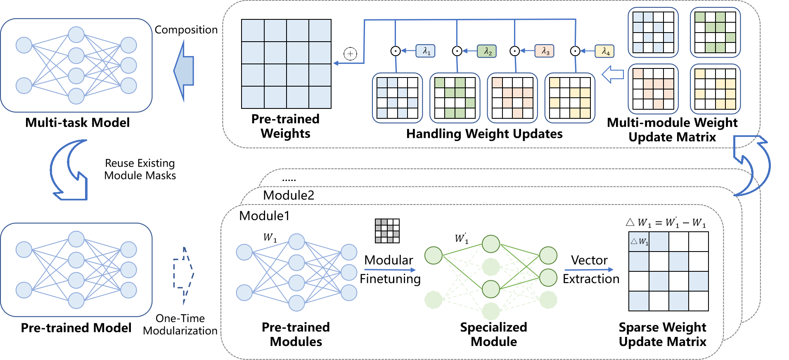

# ModularEvo: Evolving Multi-Task Models via Neural Network Modularization and Composition

[](https://python.org)
[](https://pytorch.org)

---


> **ModularEvo** enables the co-evolution of models and modules through neural network modularization and composition, achieving better performance improvement in multi-task scenarios.
## 📋 Table of Contents

- [Review Materials](#-review-materials)
- [Abstract](#abstract)
- [Key Features](#-key-features)
- [Installation](#-installation)
- [Project Structure](#️-project-structure)
- [Quick Start](#-quick-start)
- [Experimental Workflow](#-experimental-workflow)
- [Datasets](#-datasets)
- [Analysis Scripts and Metrics Calculation](#-metrics-calculation-and-analysis-scripts)
- [Results](#-results)
- [Supplementary Experimental Details](#-supplementary-experimental-details)

## 📄 Review Materials

[](#-datasets)
[](#-analysis-scripts-and-metrics-calculation)
[](#-results)

> **🔍 For Reviewers**: Quick navigation to key replication materials addressing review concerns.

<div align="center">

| 📋 **Component** | 📝 **Description** | 🔗 **Access** |
|:---|:---|:---:|
| **Datasets** | All evaluation datasets for RQs | [→ View Datasets](#-datasets) |
| **Analysis Scripts** | Metric calculation and statistical analysis scripts | [→ View Scripts](#-analysis-scripts-and-metrics-calculation) |
| **Results** | Experimental outputs and performance comparisons | [→ View Results](#-results) |

</div>

---

## Abstract

Training a general multi-task deep neural network (DNN) model, such as a large language model, and deploying it across diverse downstream tasks has become a common practice.
In long-term deployment scenarios, downstream tasks can change over time, such as new data distributions and requirements, leading to the fine-tuning of the model accordingly, i.e., evolving the model.
However, traditional full-parameter fine-tuning methods adapt the model to individual tasks, resulting in degradation of the original knowledge. 
Although parameter-efficient fine-tuning methods could mitigate this problem, they still isolate new knowledge in external, separate parameters.
As a result, the base model gains little cumulative benefit from downstream updates.
These limitations stem from the indiscriminate model deployment and fine-tuning.

Inspired by modular design principles in software engineering, we propose ModularEvo, a framework that enables on-demand deployment and co-evolution of multi-task models and modules across diverse downstream tasks.
ModularEvo first decomposes the model into task-specific modules, each retaining a subset of relevant weights and functionality.
These modules, instead of the entire model, are deployed on downstream tasks on demand.
During long-term deployment, each module is independently optimized to adjust to the change of the corresponding task.
Unlike conventional fine-tuning methods, ModularEvo applies modular fine-tuning to update only the task-relevant weights within modules.
Furthermore, new knowledge acquired by modules is periodically integrated into the model, enabling the co-evolution of both the model and modules.

We evaluate ModularEvo through extensive experiments on three Transformer models and six downstream tasks involving both classification and generation tasks.
Results demonstrate the effectiveness of ModularEvo in model performance and inference efficiency in evolution scenarios.
Compared to state-of-the-art baselines, ModularEvo achieves an absolute performance gain of 2.34\% in multi-round evolution scenarios, and a 2.22 times speedup in inference.

<div align="center">
  
  <p><em>Figure 1: ModularEvo framework workflow showing modularization, fine-tuning, and knowledge composition.</em></p>
</div>

## 🚀 Key Features

- **🧩 Modular Design**: Decompose models into functional modules for different domains
- **🔄 Co-Evolution**: Enable simultaneous evolution of models and modules
- **🎯 Multi Type Task Support**: Support for both classification and generation tasks
- **🔧 Flexible**: Compatible with CodeBERT, CodeT5, and GPT-Neo architectures

## 💻 Installation

### Prerequisites
- Python 3.8+
- CUDA-compatible GPU

### Environment Setup

1. **Download the repository**

   ```bash
   cd ModularEvo
   ```

2. **Create conda environment**
   ```bash
   conda create -n modularevo python=3.8
   conda activate modularevo
   ```

3. **Install dependencies**
   ```bash
   pip install -r requirements.txt
   ```

### Detail Requirements
| Package | Version | Purpose |
|---------|---------|---------|
| Python | 3.8.10 | Base environment |
| PyTorch | 1.8.1 | Deep learning framework |
| Transformers | Latest | Pre-trained models |
| matplotlib | 3.4.2 | Visualization |
| numpy | 1.19.2 | Numerical computing |
| tqdm | 4.61.0 | Progress bars |

## 🏗️ Project Structure

```
ModularEvo/
├── 📄 README.md                           # Project documentation
├── 🖼️ Picture_for_readme/                 # Documentation images
│   └── workflow.png                      # Framework workflow diagram
├── 🤖 Transmodular_CodeBert/              # CodeBERT experiments
│   ├── modularizer.py                    # CodeBERT modularization
│   ├── finetune/                         # Fine-tuning scripts
│   │   ├── code_clone/code/run_module.py # Code clone detection
│   │   └── nl_code_search/code/run_module.py # Natural language code search
│   └── task_merge/                       # Knowledge composition
│       ├── merge_lm.py                   # Model merging algorithms
│       └── cost.py                       # Performance evaluation
├── 🔧 Transmodular_CodeT5/                # CodeT5 experiments
│   ├── modularizer.py                    # CodeT5 modularization
│   ├── sh/run_exp_module.py              # Fine-tuning scripts
│   └── task_merge/merge_lm.py            # Knowledge composition
└── 🚀 Transmodular_GPT-Neo/               # GPT-Neo experiments
    ├── modularizer.py                    # GPT-Neo modularization
    ├── finetune/                         # Task-specific fine-tuning
    │   ├── finetune_mathqa.py            # Mathematical reasoning
    │   ├── finetune_scotus.py            # Legal classification
    │   ├── finetune_code.py              # Code classification
    │   └── finetune_langid.py            # Language identification
    ├── task_merge/merge_lm.py            # Knowledge composition
    └── longrun/                          # Multi-iteration experiments
        ├── longrun_finetune.py           # Iterative fine-tuning
        └── model_merge.py                # Iterative merging
```

## 🚀 Quick Start

### Basic Usage

1. **Model Modularization** - Decompose a pre-trained model into functional modules:
   ```bash
   cd Transmodular_GPT-Neo
   python modularizer.py --task math --do_train --lr 0.005 --n_epochs 4 --alpha 1
   ```

2. **Task Fine-tuning** - Fine-tune modules on specific downstream tasks:
   ```bash
   python finetune/finetune_mathqa.py --epoch 2 --lr 5e-5 --batchsize 8 --use_mask
   ```

3. **Knowledge Composition** - Merge evolved modules back to the base model:
   ```bash
   python task_merge/merge_lm.py --merging_method_name task_arithmetic \
     --language_model_name gptneo --model_path1 module_path1 \
     --model_path2 module_path2 --mask_rate 0.25
   ```

### Supported Models

| Model | Architecture | Tasks | Modularization |
|-------|-------------|-------|----------------|
| **CodeBERT** | Encoder-only | Code clone, NL-code search | ✅ |
| **CodeT5** | Encoder-decoder | Code generation(Concode), Code Summary | ✅ |
| **GPT-Neo** | Decoder-only | Math, Legal, Code, Language Classification | ✅ |

### Supported Tasks

| Domain | Task | Dataset | Metric |
|--------|------|---------|--------|
| 💻 Code | Clone Detection | BigCloneBench | Accuracy |
| 💻 Code | Code Search | CoSQA | Accuracy |
| 💻 Code | Code Summarization | Summary | Bleu |
| 💻 Code | Code Generation | Concode | Bleu |
| 💻 Code | Code Classification | RosettaCode, | Accuracy |
| 🧮 Math | Classification | MathQA | Accuracy |
| ⚖️ Legal | Classification | SCOTUS | Accuracy |
| 🌍 Language | Identification | Langid | Accuracy |


## 🔬 Experimental Workflow

The following sections describe how to reproduce the experimental results in our paper. We provide examples using GPT-Neo, but similar workflows apply to CodeBERT and CodeT5.

### Step 1: Model Modularization 🧩

Decompose the base model into functional modules specialized for different domains:

```bash
cd Transmodular_GPT_Neo

# Train specialized modules for different domains:
# Available domains: [math | law | europarl | github]
#   math     - Mathematics reasoning tasks
#   law      - Legal document processing
#   europarl - Multilingual text processing
#   github   - Source code understanding

python modularizer.py \
    --task math \        # Domain selection (required)
    --do_train \         # Enable training mode
    --lr 2e-5 \         # Learning rate for module specialization
    --n_epochs 4 \       # Epochs per domain adaptation
    --alpha 1 \          # Sparsity regularization weight
```

**Key Parameters:**
- `--task`: Domain for module specialization
- `--alpha`: Controls sparsity of the learned mask
- `--lr`: Learning rate for mask optimization

### Step 2: Downstream Task Fine-tuning 🎯

Fine-tune the specialized modules on specific downstream tasks:

```bash
# Fine-tuning with selective parameter update
# Available tasks: [mathqa | scotus | code | langid]
#   mathqa - Mathematical problem classification
#   scotus - Legal document classification
#   code   - Code classification
#   langid - Language identification

# Example: Fine-tune math module on MathQA
python finetune/finetune_mathqa.py \
    --epoch 2 \         # Fine-tuning iterations
    --lr 5e-5 \         # Learning rate
    --batchsize 8 \     # Batch size
    --use_mask          # Enable mask-guided fine-tuning (only updates masked parameters)

# Example: Fine-tune legal module on SCOTUS
python finetune/finetune_scotus.py \
    --epoch 2 \
    --lr 5e-5 \
    --batchsize 8 \
    --use_mask
```

**Key Features:**
- **Mask-guided fine-tuning**: Only updates parameters identified by the modularization mask
- **Task-specific adaptation**: Each module specializes for its target domain
- **Efficient training**: Reduced parameter updates compared to full fine-tuning

### Step 3: Knowledge Composition 🔄

Merge the evolved modules back to the base model using various composition strategies:

```bash
cd task_merge

# ModularEvo (Our Method) - Task Arithmetic with Modular Knowledge
python merge_lm.py \
    --merging_method_name task_arithmetic \
    --language_model_name gptneo \
    --model_path1 module_path1 \
    --model_path2 module_path2 \
    --mask_rate 0.25 \
    --batch_size 8

# Baseline Methods for Comparison:

# 1. Average Merging
python merge_lm.py \
    --merging_method_name average_merging \
    --language_model_name gptneo \
    --model_path1 model_path1 \
    --model_path2 model_path2 \
    --batch_size 8

# 2. Task Arithmetic (Standard)
python merge_lm.py \
    --merging_method_name task_arithmetic \
    --language_model_name gptneo \
    --model_path1 model_path1 \
    --model_path2 model_path2 \
    --batch_size 8

# 3. TIES-Merging
python merge_lm.py \
    --merging_method_name ties_merging \
    --language_model_name gptneo \
    --model_path1 model_path1 \
    --model_path2 model_path2 \
    --batch_size 8 \
    --param_value_mask_rate 0.75

# 4. DARE
python merge_lm.py \
    --merging_method_name mask_merging \
    --language_model_name codet5 \
    --mask_apply_method task_arithmetic \
    --use_weight_rescale \
    --weight_mask_rate 0.75 \
    --model_path1 model_path1 \
    --model_path2 model_path2 \
    --batch_size 8
```


### Step 4: Multi-iteration Evolution 🔄

Test the framework's ability to continuously evolve through multiple rounds of fine-tuning and composition:

```bash
cd longrun

# Stage 0: Initial fine-tuning
python longrun_finetune.py \
    --output ./mask_finetune_0 \
    --task_type mathqa \
    --stage 0 \
    --epochs 2 \
    --tuning_strategy mask

# Stage 0: Knowledge composition
python model_merge.py \
    --merging_method_name task_arithmetic \
    --language_model_name gptneo \
    --model_path1 module_path1 \
    --model_path2 module_path2 \
    --task longrun

# Stage 1: Continued evolution
python longrun_finetune.py \
    --output ./mask_finetune_1 \
    --task_type mathqa \
    --stage 1 \
    --epochs 2 \
    --load_model_path ./mask_finetune_0/checkpoint \
    --tuning_strategy mask

# Stage 1: Knowledge composition
python model_merge.py \
    --merging_method_name task_arithmetic \
    --language_model_name gptneo \
    --model_path1 module_path1 \
    --model_path2 module_path2 \
    --task longrun

# Continue for additional stages...
```

**Benefits of Multi-iteration Evolution:**
- **Continuous Learning**: Models improve over multiple rounds
- **Adaptation**: Models adapt to evolving task requirements

### Step 5: Inference Performance Evaluation ⚡

Assess the inference performance and acceleration capabilities of the modularized components:

```bash
python cost.py
```

**Evaluation Metrics:**
- **Inference Speed**: Inference time
- **Accuracy**: Task-specific performance metrics


## 📈 Results

The experimental output files and comprehensive data CSV files have been organized in the **[`Result/`](Result/)** folder for easy access and review. This section provides an overview of key performance improvements and detailed references to specific result files.

### 🎯 Key Performance Improvements

| Metric | Improvement | Description |
|--------|-------------|-------------|
| **Multi-round Evolution** | **+2.34%** | Absolute performance increase over baseline methods |
| **Inference Speed** | **2.22x** | Speedup in task inference |
| **Parameter Efficiency** | **~75%** | Reduction in updated parameters during fine-tuning |

### 📊 Experimental Data Files

#### 🔧 Modularization Logs
- **[`modularization_math.log`](Result/modularization_math.log)** - Detailed logs from mathematical domain modularization process
- **[`modularization_law.log`](Result/modularization_law.log)** - Detailed logs from legal domain modularization process

#### 🎯 Model Fine-tuning Logs
- **[`finetune_law_model.log`](Result/finetune_law_model.log)** - Full model fine-tuning logs for legal domain tasks
- **[`finetune_law_module.log`](Result/finetune_law_module.log)** - Modular fine-tuning logs for legal domain tasks
- **[`finetune_math_model.log`](Result/finetune_math_model.log)** - Full model fine-tuning logs for mathematical domain tasks
- **[`finetune_math_module.log`](Result/finetune_math_module.log)** - Modular fine-tuning logs for mathematical domain tasks

#### 📋 Baseline Comparisons
- **[`DARE.csv`](Result/DARE.csv)** - Detailed results for DARE (Drop And REscale) baseline method
- **[`TIES-Merging.csv`](Result/TIES-Merging.csv)** - Complete TIES-Merging baseline performance data
- **[`ModularEvo.csv`](Result/ModularEvo.csv)** - Complete performance results for our ModularEvo method across different scaling coefficients

#### 📋 Multi-task Comparison
- **[`multitask.csv`](Result/multitask.csv)** - Multi-task learning performance comparison:
  - 3-task and 4-task experimental results
  - Comparison with Task Arithmetic (TA), TIES-Merging, and DARE baselines

#### 📋 Sparsity Comparison
- **[`sparsity.csv`](Result/sparsity.csv)** - Sparsity analysis across different methods:
  - Performance impact of different sparsity levels (0, 0.25, 0.5, 0.75)
  - Comparison between TIES, DARE, and ModularEvo under various sparsity constraints
  - Optimal scaling coefficients for each configuration


#### ⚡ Performance Logs
- **[`cost_log.log`](Result/cost_log.log)** 
    - Inference time and computational cost measurements


#### 🏆 Statistical Significance
- **[`statistical_analysis_results.txt`](Result/statistical_analysis_results.txt)** 
  - Detailed statistical analysis results, including p-values and effect sizes for all comparisons


## 🔧 Metrics Calculation and Analysis Scripts

This section provides scripts for calculating all metrics reported in our paper, enabling complete replication of experimental results.

### 📊 Metrics Scripts

#### 1. Calculate Accuracy
We provide accuracy calculation scripts for different models and tasks:

**GPT-Neo Task Accuracy Calculation:**
```bash
# Mathematical reasoning task (MathQA)
python Transmodular_GPTNeo/task_merge/task_eval/math_eval.py --model_path your_model_path

# Legal document classification (SCOTUS)
python Transmodular_GPTNeo/task_merge/task_eval/scotus_eval.py --model_path your_model_path 

# Code classification task
python Transmodular_GPTNeo/task_merge/task_eval/code_eval.py --model_path your_model_path 

# Language identification task
python Transmodular_GPTNeo/task_merge/task_eval/euro_eval.py --model_path your_model_path
```

**CodeBERT Task Accuracy Calculation:**
```bash
# Code clone detection
python Transmodular_CodeBert/task_merge/task_eval/code_clone_eval.py --model_path your_model_path 

# Natural language code search
python Transmodular_CodeBert/task_merge/task_eval/nl_code_search_eval.py --model_path your_model_path
```

#### 2. Calculate BLEU Scores
We provide multiple BLEU score calculation methods:

**Standard BLEU Scores:**
```bash
# Code generation task BLEU calculation
python Transmodular_CodeT5/task_merge/task_eval/gen_eval.py --task concode --model_path your_model_path
```

#### 3. Calculate Inference Time and Speedup
We provide detailed performance benchmarking scripts:

**CodeBERT Inference Time Measurement:**
```bash
# Measure CodeBERT model inference time
python Transmodular_CodeBert/task_merge/cost.py --model_path your_model_path --batch_size your_batch_size --task code_clone
```

**GPT-Neo Inference Time Measurement:**
```bash
# Measure GPT-Neo model inference time and speedup
python Transmodular_GPTNeo/task_merge/cost.py --model_path your_model_path --batch_size your_batch_size --tasks math
```

**CodeT5 Inference Time Measurement:**
```bash
# Measure CodeT5 model inference time
python Transmodular_CodeT5/task_merge/cost.py --model_path your_model_path --batch_size your_batch_size --task concode
```

#### 4. Calculate abs_avg and norm_avg
We provide scripts for calculating abs_avg and norm_avg in the calculate_avg.py file under the Script folder:

```bash
# Calculate absolute average and normalized average
python Script/calculate_avg.py merged_task1_score merged_task2_score individual_task1_score individual_task2_score
```

**Parameter Description:**
- `merged_task1_score`: Performance score of merged model on task 1
- `merged_task2_score`: Performance score of merged model on task 2
- `individual_task1_score`: Performance score of individually fine-tuned model on task 1
- `individual_task2_score`: Performance score of individually fine-tuned model on task 2


### 📈 Statistical Analysis Scripts

#### 1. Calculate p-value and Significance Testing
We provide statistical significance analysis scripts to verify the reliability of experimental results:

**p-value Calculation:**
```bash
# Calculate p-value for paired t-test
python scripts/statistical_analysis.py
```

## 🔧 Supplementary Experimental Details

### Hyperparameter Configuration

For reproducibility, we document the optimal λ values (hyperparameters) determined through grid search:

| Model | Method | λ₁ | λ₂ | Description |
|-------|--------|----|----|-------------|
| **CodeBERT** | Task Arithmetic | 0.5 | 1.1 | Standard merging weights |
| | DARE | 0.5 | 1.0 | Drop and rescale parameters |
| | TIES-Merging | 0.7 | 1.0 | Trim, elect, and merge |
| | **ModularEvo (Ours)** | **1.0** | **0.7** | Modular composition |
| **CodeT5** | Task Arithmetic | 0.6 | 0.5 | Standard merging weights |
| | DARE | 0.6 | 0.5 | Drop and rescale parameters |
| | TIES-Merging | 1.1 | 0.9 | Trim, elect, and merge |
| | **ModularEvo (Ours)** | **0.6** | **0.6** | Modular composition |
| **GPT-Neo** | Task Arithmetic | 0.5 | 0.7 | Standard merging weights |
| | DARE | 0.6 | 1.0 | Drop and rescale parameters |
| | TIES-Merging | 0.8 | 1.2 | Trim, elect, and merge |
| | **ModularEvo (Ours)** | **0.7** | **0.9** | Modular composition |


## 📊 Datasets

ModularEvo experiments utilize a comprehensive collection of datasets spanning multiple domains and tasks. The datasets are categorized into two main types: pre-training datasets used for domain-specific modularization, and downstream fine-tuning datasets used for task-specific evaluation. All datasets are publicly available and can be downloaded from the provided sources.

## 🏗️ Pre-training Datasets

These datasets are used for domain-specific modularization and initial model training across different knowledge domains.

### The Pile Components

#### DM Mathematics
- **Description**: DeepMind Mathematics dataset with mathematical problems from The Pile
- **Tasks**: Mathematical language modeling, domain-specific modularization
- **Content**: Algebra, arithmetic, calculus, number theory problems
- **Size**: Large-scale mathematical text corpus
- **Download**: [EleutherAI/the-pile](https://github.com/EleutherAI/the-pile)

#### FreeLaw
- **Description**: Legal documents from the Free Law Project (The Pile component)
- **Tasks**: Legal language modeling, legal domain modularization
- **Content**: Court opinions, legal briefs, and judicial documents
- **Size**: Large-scale legal text corpus
- **Download**: [EleutherAI/the-pile](https://github.com/EleutherAI/the-pile)

#### EuroParl
- **Description**: European Parliament proceedings in multiple languages (The Pile component)
- **Tasks**: Multilingual text processing, cross-lingual modularization
- **Languages**: 21 European languages
- **Content**: Parliamentary debates and proceedings
- **Size**: Large-scale multilingual corpus
- **Download**: [EleutherAI/the-pile](https://github.com/EleutherAI/the-pile)

#### GitHub
- **Description**: Source code from GitHub repositories (The Pile component)
- **Tasks**: Code language modeling, programming domain modularization
- **Languages**: Multiple programming languages (Python, Java, JavaScript, etc.)
- **Content**: Open source code repositories
- **Size**: Large-scale code corpus
- **Download**: [EleutherAI/the-pile](https://github.com/EleutherAI/the-pile)

### CodeSearchNet
- **Description**: Multi-language dataset of code functions with natural language documentation
- **Tasks**: Code understanding, code-text alignment for modularization
- **Languages**: Python, Java, JavaScript, PHP, Ruby, Go
- **Size**: ~2M code-comment pairs across 6 programming languages
- **Download**: [GitHub - CodeSearchNet](https://github.com/github/CodeSearchNet)


## 🎯 Downstream Fine-tuning Datasets

These datasets are used for evaluating the performance of modularized models on specific downstream tasks, as shown in the experimental results tables.

### 🧮 Mathematical Reasoning

#### MathQA
- **Description**: Large-scale dataset for mathematical word problem solving
- **Tasks**: Mathematical problem classification and reasoning
- **Size**: ~37K training examples, ~2.9K validation, ~2.9K test
- **Format**: JSON with question, options, rationale, and topic labels
- **Evaluation**: Used in GPT-Neo experiments (Table 5) showing 94.26% accuracy with ModularEvo
- **Download**: [HuggingFace - allenai/math_qa](https://huggingface.co/datasets/allenai/math_qa)

### ⚖️ Legal Domain

#### SCOTUS (LexGLUE)
- **Description**: Supreme Court of the United States opinions dataset
- **Tasks**: Legal document classification, case outcome prediction
- **Size**: ~5K training examples, ~1.4K validation, ~1.4K test
- **Content**: Supreme Court case opinions with issue area labels
- **Evaluation**: Used in GPT-Neo experiments (Table 5) showing 69.80% accuracy with ModularEvo
- **Download**: [HuggingFace - coastalcph/lex_glue](https://huggingface.co/datasets/coastalcph/lex_glue)

### 💻 Code Understanding and Generation

#### Code Clone Detection (BigCloneBench)
- **Description**: Large-scale code clone detection benchmark
- **Tasks**: Binary classification of code clone pairs
- **Size**: ~6M code pairs with clone/non-clone labels
- **Languages**: Java source code functions
- **Download**: [HuggingFace - semeru/Code-Code-CloneDetection-BigCloneBench](https://huggingface.co/datasets/semeru/Code-Code-CloneDetection-BigCloneBench)


#### Code Search (CoSQA)
- **Description**: Natural language to code search dataset
- **Tasks**: Code retrieval using natural language queries
- **Size**: ~20K query-code pairs
- **Languages**: Python code snippets
- **Download**: [Available in CodeXGLUE benchmark](https://github.com/microsoft/CodeXGLUE)

#### Code Summarization
- **Description**: Automatic generation of natural language summaries for code
- **Tasks**: Sequence-to-sequence generation from code to natural language
- **Languages**: Multiple programming languages
- **Download**: [Available in CodeXGLUE benchmark](https://github.com/microsoft/CodeXGLUE)


#### Code Completion (Concode)
- **Description**: Code completion and generation tasks
- **Tasks**: Generating code based on natural language descriptions
- **Languages**: Java programming language
- **Download**: [Available in CodeXGLUE benchmark](https://github.com/microsoft/CodeXGLUE)

#### Rosetta Code
- **Description**: Programming problems and solutions in multiple programming languages
- **Tasks**: Code classification and programming language identification
- **Languages**: Multiple programming languages (Python, Java, C++, etc.)
- **Evaluation**: Used in GPT-Neo experiments for code classification tasks
- **Download**: [HuggingFace - christopher/rosetta-code](https://huggingface.co/datasets/christopher/rosetta-code)

### 🌍 Language Identification

#### Nordic Language Identification (Langid)
- **Description**: Nordic language identification dataset for multilingual text classification
- **Tasks**: Language identification and classification for Nordic languages
- **Evaluation**: Used in GPT-Neo experiments for language identification tasks
- **Download**: [HuggingFace - strombergnlp/nordic_langid](https://huggingface.co/datasets/strombergnlp/nordic_langid)


### 📋 Dataset Summary

#### Pre-training Datasets
| Dataset | Domain | Purpose | Size | Languages/Content |
|---------|--------|---------|------|-------------------|
| **DM Mathematics** | Math | Domain modularization | Large corpus | Mathematical notation |
| **FreeLaw** | Legal | Domain modularization | Large corpus | English legal documents |
| **EuroParl** | Multilingual | Cross-lingual modularization | Large corpus | Mutil European languages |
| **GitHub** | Code | Programming modularization | Large corpus | Multi-language code |
| **CodeSearchNet** | Code | Code-text alignment | ~2M pairs | 6 programming languages |

#### Downstream Fine-tuning Datasets
| Domain | Dataset | Task Type | Model Used | 
|--------|---------|-----------|------------|
| 🧮 **Math** | MathQA | Classification | GPT-Neo | 
| ⚖️ **Legal** | SCOTUS | Classification | GPT-Neo | 
| 🧮 **Nordic languages** | Langid  | Classification | GPT-Neo | 
| 💻 **Code** | Rosetta Code | Classification | GPT-Neo | 
| 💻 **Code** | Clone Detection | Classification | CodeBERT | 
| 💻 **Code** | Code Search | Classification | CodeBERT | 
| 💻 **Code** | Summarization | Natural Language Generation | CodeT5 | 
| 💻 **Code** | Concode | Code Generation | CodeT5 | 

---

<div align="center">
  <p><strong>ModularEvo</strong> -  Evolving Models via Neural Network Modularization and Composition</p>
</div>
