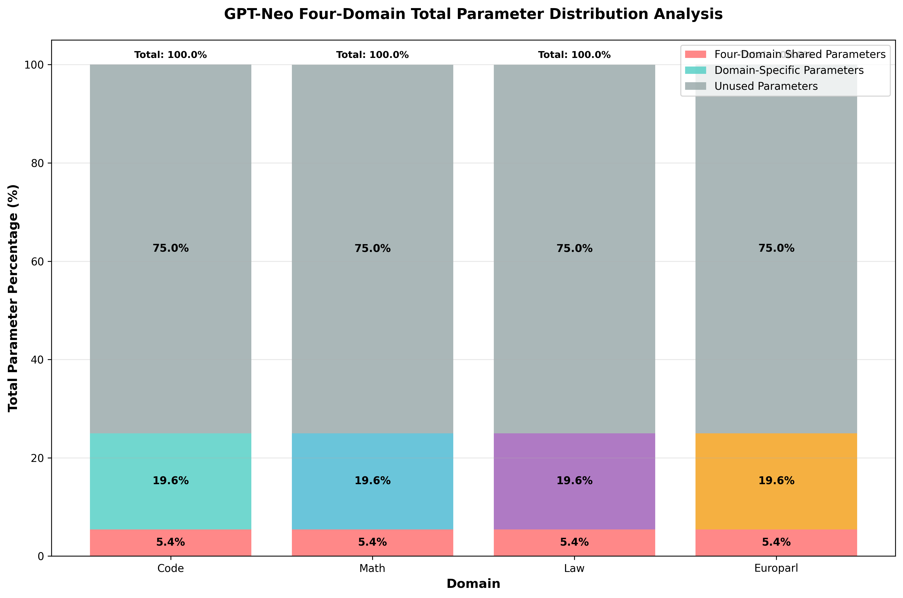
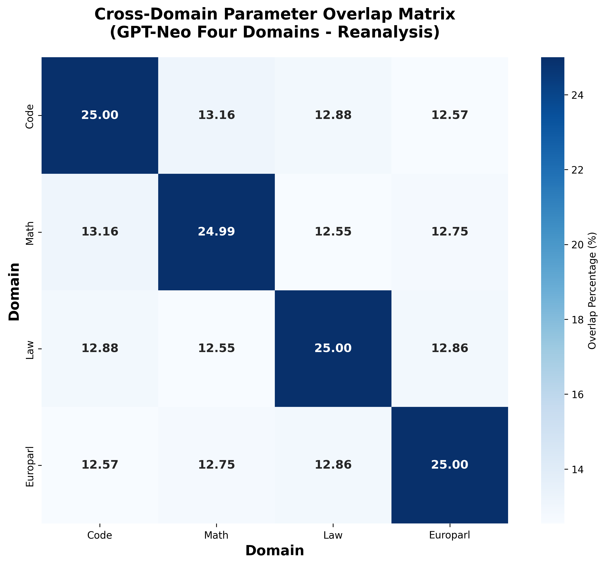
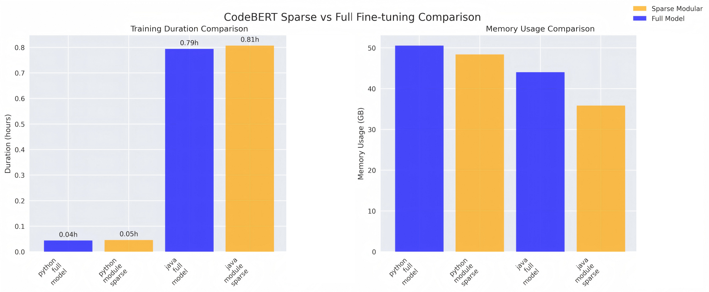

# ICSE 2026 Rebuttal Supplementary Materials

> **ModularEvo: Evolving Multi-Task Models via Neural Network Modularization and Composition**
> 
> This document provides comprehensive supplementary materials addressing all reviewer concerns raised during the ICSE 2026 review process. 

## 📋 Table of Contents

- [Review #456A](#review-456a)
  - [A2. Parameter Overlap Analysis](#a2-parameter-overlap-analysis)
  - [A3. Statistical Significance Analysis](#a3-statistical-significance-analysis)
  - [A5. Sparsity Level Determination](#a5-sparsity-level-determination)
- [Review #456B - Methodology Clarity](#review-456b---methodology-clarity)
  - [B3. Training Time Impact Analysis](#b3-training-time-impact-analysis)
  - [B5. Pre-training and Modularization Setup](#b5-pre-training-and-modularization-setup)
  - [Question in detailed comments](#question-in-detailed-comments)
- [Review #456C](#review-456c)
  - [Question in detailed comments](#question-in-detailed-comments-1)

---

## Review #456A 

### A2. Parameter Overlap Analysis

Shared parameter ratio: There is overlap between the parameters of these two modules, because even modules for different fields require some basic capabilities, such as mathematics and law at least require semantic understanding capabilities. Taking CodeBert as an example, the number of parameter overlaps accounts for about 10% of the total number of parameters and about 50% of each module. We believe that this is because CodeBert is in the field of code, and its separated Python modules and Java modules are largely similar in basic knowledge, which makes the overlap account for the majority. At the same time, we also analyzed the four modules of GPT-NEO, and the results showed that the overlap weight only accounted for 5.4% of the total number of parameters, about 20% of each module.

#### Overlap analysis

*Figure A2.1: GPT-Neo parameter overlap distribution across layers*

*Figure A2.2: CodeBERT parameter overlap distribution across layers*

#### Module independence analysis

The modules show a certain degree of parameter independence. First, we visualize the weight distribution of different modules of CodeBert on each layer of parameters. We observe that even if there are shared parameters, different modules will show different weight differences at different levels, which to a certain extent shows the parameter independence between modules. 
In addition, we also analyzed the parameters of the four models of GPT-Neo, and we can see that there is a certain degree of independence between their parameters.

*Figure A2.3: Layer-wise weight differences showing module independence despite overlap*

*Figure A2.4: GPT-Neo cross-domain parameter overlap patterns*

### A3. Statistical Significance Analysis

**Question**: Did the authors conduct repeated experiments and compute p-values?

**Comprehensive Statistical Validation**:

#### Repeated Experiments Setup
- **Seeds**: 3 different random seeds
- **Metrics**: Task-specific and composite performance measures
- **Models**: CodeBERT

#### CodeBERT Statistical Results

| Method | Mean Norm_avg | Std Dev  | p-value vs ModularEvo |
|--------|---------------|---------|--------|
| TIES-Merging | 95.62% | ±0.13% |  0.000006 |
| DARE | 96.83% | ±0.16% |  0.000085  |
| **ModularEvo** | **98.67%** | ±0.11% |  - |

### A5. Sparsity Level Determination

**Question**: How was the 25% parameter retention ratio determined?

**Comprehensive Analysis**: The 25% parameter retention (75% sparsity) was determined through comprehensive analysis balancing module capability and knowledge fusion effectiveness.

**Experimental Data**:
1. Loss performance of different sparsity modules on pre-training datasets

| Module     | Dataset                 | Sparsity | MLM Loss | Loss Increase |
| ---------- | ----------------------- | -------- | -------- | ------------- |
| Python-25% | Code_Search_Net(Python) | 25%      | 0.7659   | -             |
| Python-7%  | Code_Search_Net(Python) | 7%       | 0.9799   | **27.94%**    |
| Java-25%   | Code_Search_Net(Java)   | 25%      | 1.1498   | -             |
| Java-7%    | Code_Search_Net(Java)   | 7%       | 1.5420   | **34.11%**    |

2. Conflicts caused by low sparsity (high density) make knowledge fusion less effective

| Method       | Sparsity=0.75 | Sparsity=0.5 | Sparsity=0.25 | Sparsity=0 |
| ------------ | ------------- | ------------ | ------------- | ---------- |
| DARE         | 98.00         | 98.41        | 98.54         | 97.97      |
| TIES-Merging | 98.03         | 98.35        | 98.34         | 98.13      |
| **ModularEvo**     | **99.08**     | **98.90**    | **98.78**     | **97.97**  |

#### Key Findings
1. **Sweet Spot**: 25% retention balances module capability and knowledge fusion

---

## Review #456B - Methodology Clarity

### B3. Training Time Impact Analysis

**Question**: What is the impact of modularization on overall training time?

#### Fine-tuning Time And Memory Comparison

| Model | Task | Full Model Time | Module Time | Memory Usage (Full) | Memory Usage (Module) |
|-------|------|----------------|-------------|-------------------|---------------------|
| **Java CodeBERT** | Clone Detection | 0.79h | 0.81h (+2.5%) | 50.6 GB | 48.4 GB (-4.3%) |
| **Python CodeBERT** | Code Search | 0.04h | 0.05h (+25%) | 44.0 GB | 35.8 GB (-18.6%) |
| **GPT-Neo** | MathQA | 1.2h | 1.25h (+4.2%) | 32.1 GB | 28.7 GB (-10.6%) |
| **CodeT5** | Summarization | 2.1h | 2.15h (+2.4%) | 45.8 GB | 38.2 GB (-16.6%) |

---
### B5. Pre-training

**Question**: What are the pre-training details ?

#### Pre-training Details

| Model                       | CodeBERT                            | CodeT5-base                                                  | GPT-Neo (125M)                          |
| --------------------------- | ----------------------------------- | ------------------------------------------------------------ | --------------------------------------- |
| **Base Architecture**       | RoBERTa-base (Encoder)              | T5 (Encoder-Decoder)                                         | GPT-2-like (Decoder)                    |
| **Parameters**              | 125 million                         | 220 million                                                  | 125 million                             |
| **Pre-training Dataset**    | CodeSearchNet                       | CodeSearchNet ， C/C# （from BigQuery）                      | The Pile                                |
| **Pre-training Objectives** | MLM, Replaced Token Detection (RTD) | Masked Span Prediction (MSP), Identifier Tagging (IT), Masked Identifier Prediction (MIP), Bimodal Dual Generation | Autoregressive Language Modeling        |
| **Optimizer**               | Adam                                | AdamW-like (peak LR with linear decay)                       | AdamW                                   |
| **Learning Rate**           | 5e-4                                | Peak 2e-4 (linear decay)                                     | 6.0e-4 (cosine decay)                   |
| **Batch Size**              | 2048                                | 1024                                                         | 256 (global)                            |
| **Hardware**                | 1x NVIDIA DGX-2 (16x V100 32GB)     | 16x NVIDIA A100 40GB                                         | TPU v3-256                              |
| **Training Steps/Duration** | 100K steps                          | 100 epochs (Denoising) + 50 epochs (Bimodal Dual); (12 days for Base model) | Approx. 300,000 steps (approx. 1 epoch) |

### Question in detailed comments

1. Why is the downstream task of GPT, which is usually used for generation tasks, set as a classification task?

    Because GPT-Neo covers a wider range of fields, we hope to verify the specific performance of ModularEvo in multiple fields on GPT-Neo. However, there are relatively few data sets for generation tasks in multiple fields, and generation tasks are more time-consuming than classification tasks. Limited by resources, time, and experiments with different numbers of modules, we finally chose classification tasks. Moreover, although they are classification tasks, these tasks (such as MathQA, SCOTUS) themselves also require the model to have strong text understanding and reasoning capabilities, which are the basis for high-quality generation. Therefore, even through classification task evaluation, it can indirectly reflect some of its core capabilities as a language model.

    Moreover, our experimental design has covered different architectures and task types (including generation tasks and classification tasks), which is sufficient to verify the universality of ModularEvo.

---

## Review #456C 

### Question in detailed comments
#### 1.Issues related to experimental design
   
(1)Why is the repository customized according to the model?
  
  > We are very sorry that the current repository and model are tightly coupled, which makes it far from a truly reusable tool support method. First, this allows us to reproduce our experiments more intuitively and effectively. Second, in order to verify the experiments on as wide and supported datasets as possible, we try to use the model's officially recommended code repository and downstream data for fine-tuning to ensure the verifiability of the fine-tuning effect. We will further optimize and launch more general experimental codes in the repository in the future.

   (2) Why choose these three models?

> ​ Because these models are representative and widely studied open source models in their respective fields (CodeBERT/CodeT5 for code intelligence, GPT-Neo for general language modeling), with public pre-trained weights, pre-trained datasets, and mature downstream task evaluation benchmarks (such as CodeXGLUE, LexGLUE, etc.). Codebert and Codet5 are widely used in software engineering, and their specific downstream tasks are also closely related to software engineering research. Although some models may not be the latest, their core architecture and pre-training methods are sufficient to serve as an effective platform for verifying the modularization and evolution mechanism we proposed. Our goal is to verify the core idea of ​​the method, rather than relying on the SOTA performance of the latest model.

  (3) Why were these four baselines chosen?

> ​ For the selection of four baseline methods, we comprehensively considered that they are representative and well-performing methods in the field of model merging and modular evolution. And these methods cover from simple weight averaging to more complex task vector-based post-processing (such as pruning and symbol repair of TIES-Merging, random sparsification and scaling of DARE). This provides a strong comparison background for ModularEvo to highlight its advantages in effective knowledge fusion.

  (4) RQ2 How is the experiment organized and how are the indicators collected?

> ​ We apologize for the lack of details in the RQ2 experiment. Here we describe the evaluation method of inference efficiency in detail: for each model and task, we ran 20 inference batches, each batch of codeclone task contained 4 samples, each batch of nl_code_search task contained 8 samples, and recorded the total execution time, and then calculated the average single batch inference time. To ensure the reliability of the measurement, we performed 5 batches of warm-up runs before each measurement to exclude the impact of initialization overhead. The tests were performed on the CPU separately, and the average and standard deviation were reported to evaluate the stability of the results. For the sparse acceleration test, we also adopted the strategy of 20 iterations and 5 warm-up runs, and exported the model to ONNX format for benchmarking. All tests were conducted on the same hardware environment to ensure that the experiments were conducted in an environment without interference from other high-load processes to obtain fair performance comparison results. All experiments for RQ2 were conducted on HuaweiXH321V5,0.5U, with 2*Intel(R) Xeon(R) Silver 4214CPUs@2.20GHz. Finally, I apologize again for the shortcomings in the replication package, because the data analysis script for RQ2 has long been located in cost.py under Transmodular_CodeBert/task_merge in the repository, and the chaotic code structure makes it difficult for you to effectively obtain the script. 

#### 2. Overhyping Answers

> ​ Thank you very much for the reviewer's careful observation and criticism on the interpretation of the results. We understand your concern about the possible "over-hyping" and insufficient discussion of the performance difference between ModularEvo and "Individual" fine-tuning. As the reviewer pointed out, on many single tasks, the performance of "Individual" fine-tuning (i.e., targeted fine-tuning of the entire model) does outperform the global model after ModularEvo fusion. "Individual" fine-tuning uses all the resources of the model to optimize a single task, and naturally may reach a higher performance ceiling on that task. The goal of ModularEvo is to build a single model that performs well on multiple tasks, is continuously evolving, and is efficient in inference. This multi-objective optimization itself may lead to an inability to compete with highly specialized models on certain single-point tasks.
>
> ​ Specifically, the performance of the concode task dropped dramatically. We believe that this is mainly because the concode task is to convert natural language into code, while the summarization task is to summarize code into natural language. The two tasks are relatively different in language and task objectives, which leads to a sharp performance drop. However, from a practical point of view, in some scenarios with extreme performance requirements, this gap may indeed be unacceptable. Therefore, we will follow the reviewers' opinions and present these comparisons more objectively and comprehensively in the discussion section during subsequent revisions, clearly pointing out the applicable scenarios and potential performance trade-offs of ModularEvo, and avoiding any statements that may be regarded as "over-promotion".
---

